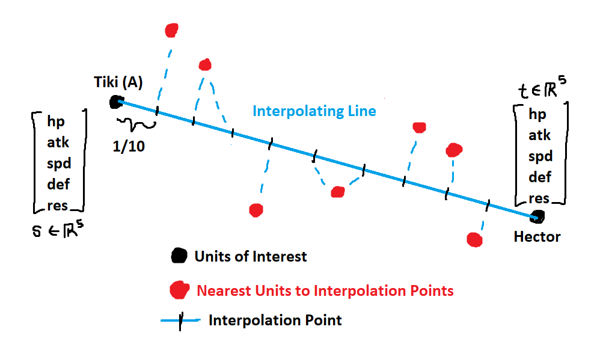
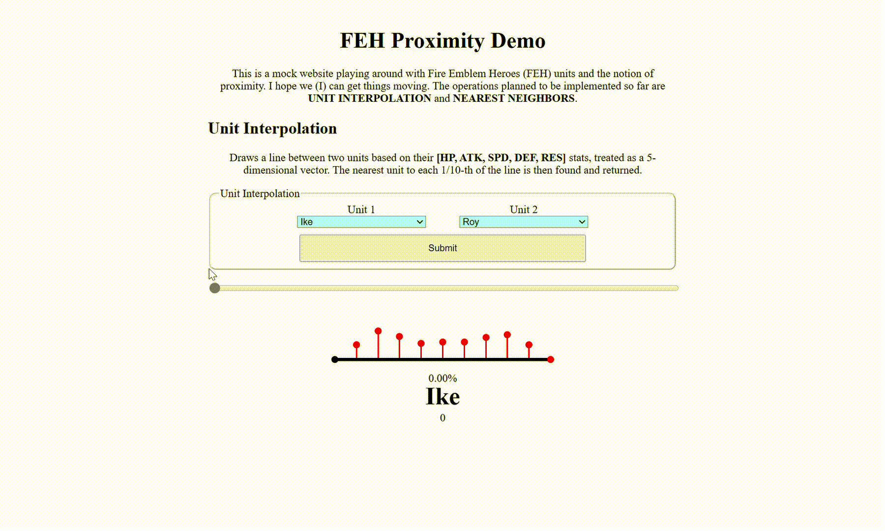

An updated version of the FEH Unit Comparison, the repository for that can be found [here](https://github.com/KaytchJam/FEH_Unit_Comparisons):

Dataset is courtesy of u/_vinventure and the many other contributors to the FEH Unit spreadsheet [here](https://www.reddit.com/r/FireEmblemHeroes/comments/12vgm0u/introducing_a_filterable_spreadsheet_of_all_feh/).

The figure above is a visualization of what this repository does. We take two FEH Units, construct an interpolating line between said units (treated as points based on their stats), and then find the nearest unit to said interpolation point based on a given metric. Nearest neighbor computation is sped up through the use of a KDTree data structure. 

